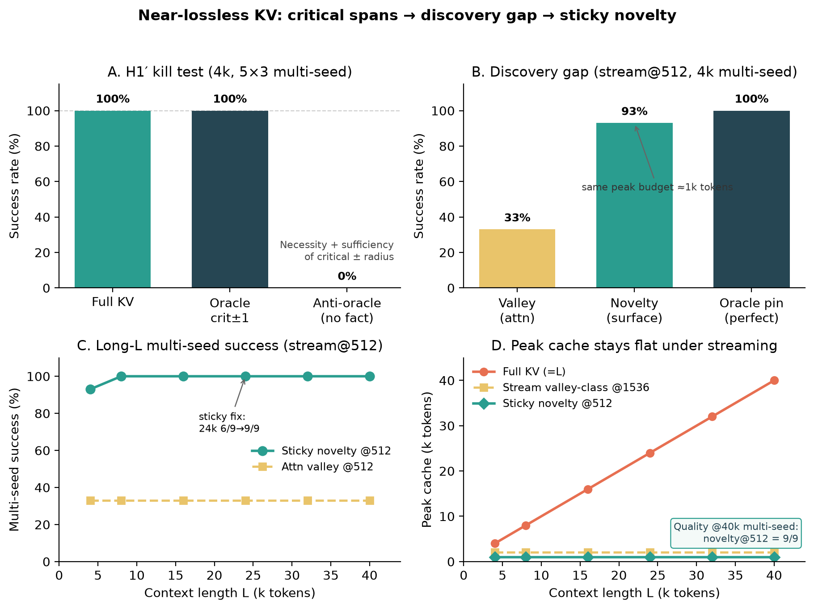

# Near-Lossless Long Context under Fixed VRAM via Critical-Span Retention

**Status:** portfolio / workshop-style draft (narrative + figure)  
**Lab:** RTX 3090 24 GB · primary `Qwen/Qwen3-4B-Instruct-2507`  
**Repo:** nearlossless-context  
**Last updated:** 2026-07-16  

> Primary multi-seed tables: `results/paper_rigor_*`, `novelty_*`, `FINDINGS.md`.  
> **Figure:** [`figures/fig1_story.png`](figures/fig1_story.png) (regenerate: `python experiments/plot_paper_figures.py`).  
> **Readable PDF:** [`main.pdf`](main.pdf) — build with `powershell -File papers/build_pdf.ps1` (LaTeX source: `main.tex`).

---

## Abstract

Long-context inference is limited by KV-cache memory. Training-free eviction methods shrink the cache, but it is often unclear *which* tokens are necessary for near–full-KV quality. On a multi-seed controlled retrieval suite (Qwen3-4B, RTX 3090), we show three linked results:

1. **Structure (H1′).** Retaining critical fact tokens plus a small local radius \(R^*=1\) (with attention sinks and a recent/question window) is **necessary and sufficient** for ε≈0 single-fact recall: oracle **15/15**, anti-oracle **0/15**, full KV **15/15** (5 seeds × 3 depths @4k).
2. **Discovery gap.** Online streaming at a moderate peak budget fails under multi-seed hay not because the budget is too small, but because **query-unknown discovery is weak**: attention stream@512 is **33%**, while perfect online pin of critical±R is **15/15** at the same peak.
3. **Closing the gap.** A **surface novelty detector** (within-prefix rarity + digit/ID-like cues; no final question) with **sticky pin packing** reaches **~93%** multi-seed @4k and **100%** (3×3) through **40k** at stream@512—peak cache **~1k tokens**, flat in \(L\).

The critical-span mechanism transfers across Qwen2.5, Llama-3.2, and hybrid Gemma-4 (full layers). We do **not** claim general long-context SOTA; see §Limitations.

---

## 1. Introduction

KV cache memory grows with context length \(L\). On a fixed workstation (here: 24 GB), full-cache decode becomes the bottleneck long before “the model cannot attend.” Training-free compressors (observation-window scoring, recent-only eviction, SnapKV-style selection) reduce tokens kept, but practice often optimizes average scores rather than **guaranteeing** the spans that encode answers.

We study **near-lossless** compression on retrieval-critical prompts: quality \(Q\) should match full KV at ε≈0 under a multi-seed protocol. The systems objective is

\[
L_\varepsilon \;=\; \max\{\, L : Q(M,L) \ge (1-\varepsilon)\,Q(\mathrm{Full},L) \,\}
\]

under **peak** cache / VRAM constraints—not only final decode size after a full prefill.

**Claim.** Near-lossless training-free KV compression is better understood as **retaining critical local neighborhoods** (and discovering them online before the question exists) than as uniform thinning or posthoc score ranking alone.

---

## 2. Related work (sketch)

- **Eviction / selection:** H2O, SnapKV, pyramid and related training-free keepers.  
- **Hybrid attention:** sliding-window + full layers (e.g. Gemma-4); full-layer KV still dominates compressible state.  
- **Quantization** (KIVI, etc.): complementary; we use fake-int8 only for logical byte accounting.  

**Positioning.** Mechanism + workstation \(L_\varepsilon\), not a leaderboard chase. Novelty is a **query-unknown discovery** layer on top of H1′ retention, not a new attention kernel.

---

## 3. Methods (short)

**Task.** Needle-in-haystack style secrets in seeded filler; depths \(\{0,0.5,1\}\); success = exact key recall (greedy decode).

**H1′ keep set.** sinks ∪ critical±\(R\) ∪ recent/question window. Kill arms: full, oracle_r1, anti_oracle.

**Posthoc scorer.** `seed_valley`: shared obs-window attention → seeds → contiguous valley + ±R.

**Streaming.** Chunked prefill; compress when cache > budget; peak ≈ budget + chunk.

**Oracle-online upper bound.** Force-keep critical±R whenever still in cache (perfect discovery).

**Surface novelty (query-unknown).** Per-token score from within-prefix rarity, first occurrence, and surface cues (digits, ID-like pieces). Expand peaks ±R into pin sets. **Sticky** registry: once discovered, pins stay until evicted; packing ranks pins by score under budget (sinks + recent reserved).

**Default API.** `prefill_auto(..., mode="stream", discovery="novelty")`.

---

## 4. Results

### Figure 1 — Story in four panels



**A. H1′ kill (4k, 5×3 multi-seed).** Full and oracle crit±1 both **15/15**; anti-oracle **0/15**. Bare critical tokens without radius often corrupt trailing digits (H1 needs local context); \(R^*=1\) restores ε≈0. Mean |oracle| ≈ **149** tokens vs full ~4k.

**B. Discovery gap (stream@512, same multi-seed protocol).** Attention valley **33%**; surface novelty **93%** (14/15); oracle pin **100%**. Peak budget is in the same class (~1k with chunk). Failures of valley at 512 are **detector** failures, not “stream cannot work.”

**C. Long \(L\) multi-seed (3×3).** Sticky novelty@512 is **9/9** at 16k, 24k, 32k, and **40k**. Non-sticky novelty degraded at 24k (~6/9) via re-rank thrash; sticky packing fixed it. Valley@512 remains end-depth-only (~33%) under multi-seed hay as \(L\) grows.

**D. Peak cache.** Full KV scales with \(L\); sticky novelty stream@512 stays **~1k** tokens. Prior valley operating points often used **~1.5–2k** peak for long \(L\).

### Scorer tax (posthoc, question known)

| Method | All-cell \(B_{\min}\) | Tax vs mean \|oracle\| |
|--------|----------------------|-------------------------|
| oracle_r1 | ~149 | 1.0× |
| seed_valley | **192** | ~**1.24×** global / ~**1.16×** mean |

Posthoc is near-oracle-tight; **stream is not**, until discovery improves.

### Stress and transfer (summary)

| Check | Result |
|-------|--------|
| NL facts (names/places) sticky novelty@512 | **15/15** multi-seed |
| Code needles sticky | **15/15** |
| Adversarial ID-like filler (pre-sticky) | novelty **100%** vs valley **33%** |
| Multi-needle recall_all @512 | novelty **5/5** (`max_new≥96`); valley **0/5** |
| 2-hop (Alice→id→password) @512 | novelty **5/5**; valley **1/5** (needs @1024 for 5/5) |
| 3-hop + distractors @512 | novelty **5/5**; valley **0/5** (needs @1024 for 5/5) |
| Prose soft fact (no digits) @512 | novelty **15/15**; valley **53%** |
| Multidoc (6 titled docs) @512 | novelty **15/15**; valley/oracle_pin **5/15** |
| External-style mixed QA (10 items, ~4k padded) | novelty **10/10** hits (= full); valley **0/10** |
| Gemma-4 E4B hybrid novelty@512 | multi-seed **9/9** @4k (valley needs ~1024) |
| Qwen2.5 / Llama-3.2 | H1 holds; family-specific posthoc floors |

### Systems resources (peak VRAM / latency)

Mid-depth needle, seed 0 (`systems_resources_20260717T130143Z`):

| L | full peak VRAM | novelty@512 peak VRAM | full decode KV | novelty KV | novelty prefill |
|---|----------------|----------------------|----------------|------------|-----------------|
| 4k | 8.5 GB | **8.3 GB** | 569 MB | **72 MB** | 1.6 s |
| 16k | 10.6 GB | **8.3 GB** | 2296 MB | **72 MB** | 5.9 s |
| 40k | 14.5 GB | **8.3 GB** | 5754 MB | **72 MB** | 17.6 s |

Peak cache tokens stay **~1024** under novelty stream@512 at all three lengths. Full 40k prefill was extremely slow on this workstation session (~20 min; WDDM path); novelty remains interactive.

---

## 5. Adaptive policy (systems)

`prefill_auto` applies L-based budgets + per-model floors. With default `discovery="novelty"`, single-needle stream@**512** is the measured multi-seed operating point through **40k**. Attn-only discovery still needs larger floors (~1536 multi-seed @4k). Hybrid Gemma: compress **full** layers only; sliding layers keep absolute prefix bookkeeping for score-pass.

---

## 6. Limitations and what we do **not** claim

### 6.1 What we claim

- On this **controlled multi-seed retrieval suite**, critical±\(R^*\) is necessary/sufficient for ε≈0 single-fact recall.  
- Stream failures at moderate budget are primarily a **query-unknown discovery** problem (oracle-online upper bound).  
- Sticky surface novelty **closes most of that gap** through **40k** multi-seed at peak cache ~1k on the primary model, with transfer smoke to other small instruct models including hybrid Gemma-4.  

### 6.2 What we do **not** claim

| Not claimed | Why |
|-------------|-----|
| **General long-context SOTA** | No full RULER / LongBench / InfiniteBench leaderboard. A small mixed-domain external-style slice (10 items) matches full under novelty; not a public leaderboard. |
| **All task types** | Suite is retrieval / needle-class (plus limited multi-needle and NL fact variants). Reasoning chains, code repos, and multi-doc QA are largely untested. |
| **Oracle-tight online budgets for free** | Sticky novelty matches multi3/hop quality at@512 on this suite when decode budget is adequate; multi-secret packing still stresses oracle_pin@512 (2/5). Suite-alignment of surface novelty remains. |
| **Production memory stack** | Fake-int8 is logical accounting only; no fused CUDA kernels, paged attention productization, or serving integration. |
| **Novelty as universal “importance”** | Detector exploits **surface distinctness** vs repetitive filler. Secrets that look like filler, or filler that looks like IDs, can still confuse discovery (adv suite is only a partial stress). |
| **Large models / long training-free SOTA** | Primary evidence is **~3–4B** instruct models on one GPU class. |
| **Statistical finality** | Multi-seed \(N\) is modest (5×3 @4k; 3×3 long-\(L\)). Results are **lab-grade**, not a large multi-run meta-analysis. |
| **ε=0 beyond measured envelope** | Sticky multi-seed is measured through **40k**; longer \(L\) is extrapolation until re-run. |
| **Peak VRAM = final decode KV** | Streaming caps **peak cache tokens**; activation/workspace memory and model weights still dominate total VRAM. |

### 6.3 Threats to validity

- **Greedy decode** and chat templates may interact with exact-match scoring.  
- **Filler distribution** is synthetic; natural corpora may change novelty baselines.  
- **Hybrid models:** only full layers are compressed; sliding-window behavior is infrastructure-sensitive.  
- **Selection bias toward positive arms:** we iterated methods until discovery worked; negative results (scored capsules alone, non-sticky long-\(L\)) are reported but the path is research-in-the-loop.

---

## 7. Conclusion

Near-lossless training-free KV compression on retrieval tasks is structured by **critical local neighborhoods**. When the question is known, a simple attention valley scorer approximates the oracle keep set with small tax. When the question is **not** known—as in online streaming—the binding constraint is **discovery**. Sticky surface novelty is a lightweight query-unknown detector that, on our multi-seed suite, restores high success through **40k** context at a **flat ~1k-token peak cache**, transferring to hybrid Gemma-4 at primary-class budgets. The honest next steps are broader tasks and multi-entity packing—not larger single-needle grids alone.

---

## Reproducibility

```text
# Multi-seed H1 + scorer tax
python experiments/bench_paper_rigor.py --seeds 0,1,2,3,4 --ctx 4096

# Discovery gap / novelty
python experiments/bench_capsules.py --novelty --oracle-online --skip-capsules --budgets 512
python experiments/bench_novelty_stress.py
python experiments/bench_novelty_longL.py --ctx 16384,24576,32768,40960 --arms novelty --budgets 512

# Figure
python experiments/plot_paper_figures.py

# Transfer
python experiments/bench_transfer.py --model google/gemma-4-E4B-it
```

**Primary model:** `Qwen/Qwen3-4B-Instruct-2507`, transformers, CUDA bf16, RTX 3090.  
**Artifact index:** `results/FINDINGS.md`.
